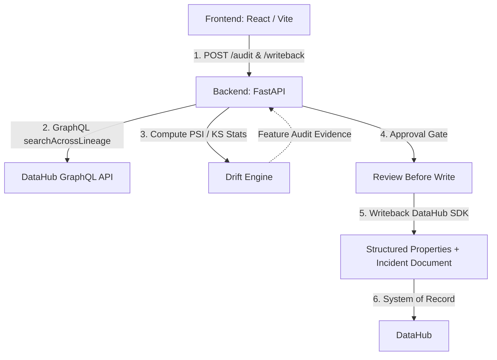

# DataHub ML Drift Sentinel

DataHub ML Drift Sentinel turns DataHub's own governance layer — lineage, structured properties, and native document entities — into the system of record for ML drift incident response.

Built for the **DataHub AI/ML Agent Hackathon**.

---

## Architecture



---

## Setup & Running Instructions

### 1. DataHub Quickstart
Start a local DataHub instance (requires Docker):
```bash
datahub docker quickstart
```

### 2. Backend Environment
Set up the Python 3.12 environment and install dependencies:
```bash
python3 -m venv venv
source venv/bin/activate
pip install -r requirements.txt
```

Seed DataHub with models, dataset lineages, and structured property definitions:
```bash
export DATAHUB_GMS_URL="http://localhost:8080"
python data/seed_lineage.py
```

### 3. Run the Backend API
Start the FastAPI server:
```bash
python backend/main.py
```
*(Runs at `http://localhost:8000`)*

### 4. Run the Frontend App
In a new terminal window:
```bash
cd frontend
npm install
npm run dev
```
*(Runs at `http://localhost:3000`)*

### Port Summary
| Service | Port | Description |
|---|---|---|
| **DataHub GMS** | `8080` | DataHub REST & GraphQL API |
| **DataHub UI** | `9002` | Native DataHub Web Application |
| **Backend API** | `8000` | FastAPI Sentinel Server |
| **Frontend UI** | `3000` | React / Vite Dashboard |

---

## Data Authenticity Note

> **Important Note:** All model entities (`churn_model`, `fraud_model`), dataset entities (`raw_transactions`, `raw_payments`, `churn_features`, etc.), lineage relationships, training jobs, and `StructuredProperty` schemas are **real DataHub metadata entities** created and stored directly in DataHub.
>
> The feature value rows in the underlying CSV files are **intentionally synthetic** and engineered for a legible demo. They guarantee deterministic, readable signals for demonstration purposes.

---

## API Endpoints

| Method | Endpoint | Description |
|---|---|---|
| `GET` | `/models` | Discovers and returns all registered `mlModel` entities from DataHub. |
| `POST` | `/audit/{model_urn}` | Walks lineage and computes PSI & KS statistical drift evidence across all upstream features. |
| `POST` | `/writeback/{model_urn}` | Publishes structured properties and an incident document directly to DataHub as the system of record. |

---

## Two Models

The repository is seeded with two distinct models to demonstrate that the system generalizes and is not just a single rigged case:
1. **`churn_model`**: Intentionally engineered with drifting data (`refund_rate` PSI is significantly shifted). It reliably flags as **HIGH** risk and generates critical incident reports.
2. **`fraud_model`**: Intentionally engineered with perfectly stable data. It reliably flags as **LOW** risk and provides a clean, stable contrast case to demonstrate normal operational behavior.

---

## Rehearsing the Demo

Before each rehearsal run, reset DataHub to a clean demo state with a single command:

```bash
python scripts/reset_demo_state.py
```

This script:
- Re-seeds both models (`churn_model`, `fraud_model`) with their original structured properties (UPSERT — no duplicates)
- Deletes any previously-written incident report documents
- Clears drift-related structured properties (`drift_psi_score`, `drift_risk_level`, `last_checked_timestamp`) from upstream dataset entities
- Verifies no duplicate structured properties exist on either model

Safe to run as many times as needed — every operation is idempotent.

### Suggested Demo Order

To effectively showcase the system of record integration, we recommend the following flow:
1. **Open DataHub** on the target model entity (`churn_model` or `fraud_model`) first, showing its current clean state (no incident documents, basic structured properties).
2. **Switch to the Sentinel App** and navigate to the model's detail page.
3. **Run Audit** to trace lineage and calculate the live statistical evidence (PSI/KS).
4. **Review the Approval-Gate Panel** to examine the exact payload (properties and document content) that will be written.
5. **Confirm Write** to publish the evidence directly to DataHub.
6. **Switch back to DataHub and refresh** to demonstrate the live update: the model now has an active incident document attached, and its upstream datasets are tagged with drift properties.

---

## License
Apache 2.0 (See `LICENSE`)
