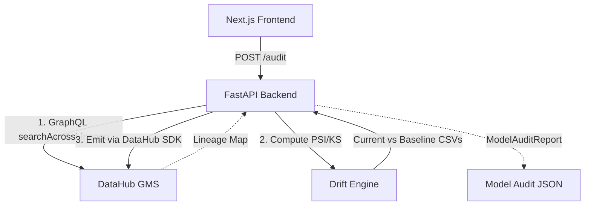

# DataHub ML Drift Sentinel

An automated framework for Machine Learning model drift detection, DataHub lineage integration, and incident write-back.

Built for the **DataHub AI/ML Agent Hackathon**.

## Overview
ML Drift Sentinel bridges the gap between Machine Learning drift detection and enterprise metadata management. It walks DataHub lineage to identify the upstream data tables that feed into a specific ML Model, executes statistical drift checks (PSI, KS tests) on those features, and writes the results back directly into DataHub as Structured Properties and Markdown Incident Reports.

**Key Features:**
- **Lineage-Driven Audits:** Uses the DataHub Python SDK's GraphQL client (`searchAcrossLineage`) to resolve `mlModel` entities to their physical `dataset` origins.
- **Statistical Drift Engine:** Implements the Population Stability Index (PSI) and Kolmogorov-Smirnov (KS) non-parametric test.
- **Idempotent Write-Backs:** Emits Structured Properties (`drift_psi_score`, `drift_risk_level`, `last_checked_timestamp`) via the DataHub SDK REST emitter (UPSERT) and links Markdown incident documents to the model natively in DataHub.
- **Premium UI:** Next.js + FastAPI interface to manually trigger audits and visualize live lineage dependencies dynamically.

## Architecture



> **Note:** The data analyzed by the drift engine in this repository (`data/baseline_features.csv` and `data/current_features.csv`) is 100% synthetic data generated strictly for demonstration purposes.

## Repository Setup & Usage

### 1. Prerequisites
You will need a local DataHub instance running on port 8080 (GMS) and 9002 (Frontend).
```bash
datahub docker quickstart
```

### 2. Environment Setup
Create a virtual environment and install dependencies:
```bash
python3 -m venv venv
source venv/bin/activate
pip install -r requirements.txt
```

### 3. Seed Metadata
Execute the setup script to seed DataHub with the synthetic models, datasets, and structured property definitions:
```bash
export DATAHUB_GMS_URL="http://localhost:8080"
export DATAHUB_GMS_TOKEN="<your_personal_access_token>"

python data/seed_lineage.py
```

### 4. Running the Backend & Frontend
Start the FastAPI wrapper:
```bash
python backend/main.py
```
Start the Next.js UI:
```bash
cd frontend
npm install
npm run dev
```
Navigate to `http://localhost:3000`.

## OSS Contribution

This project includes a formalized DataHub Skill contribution located in `skills/datahub-ml-drift/`. This provides autonomous coding agents (Claude, Copilot, etc.) with the exact methodologies and commands necessary to execute drift detection and DataHub write-backs.

**Pull Request:** This skill has been submitted to the official DataHub repository: [datahub-project/datahub-skills#42](https://github.com/datahub-project/datahub-skills/pull/42).

## Demo Video
*(Demo Video link will be inserted here)*

## Examples
See `examples/sample_incident_report.md` for a generated markdown document mimicking the exact content injected into DataHub.

## License
Apache 2.0 (See `LICENSE`)
