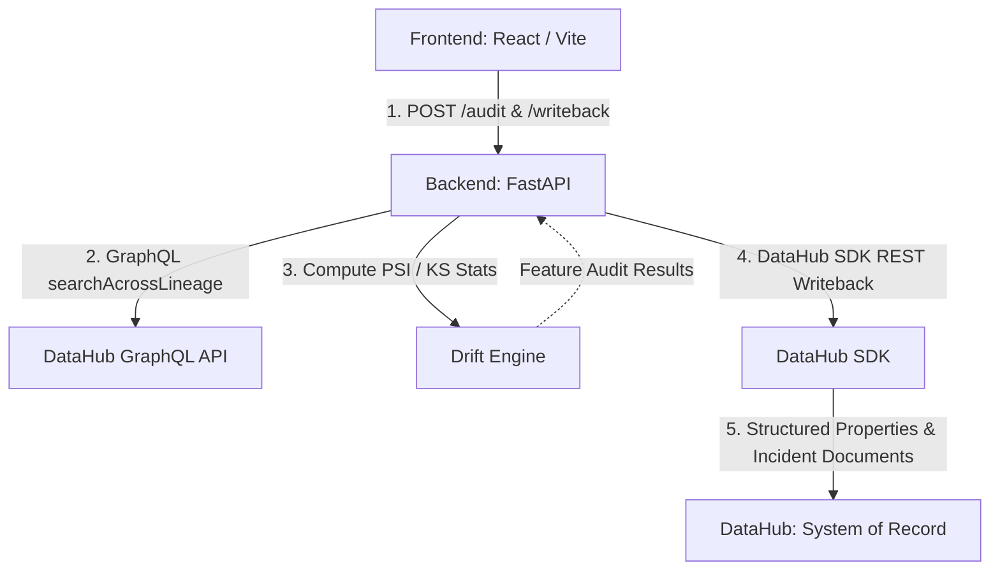

# DataHub ML Drift Sentinel

DataHub ML Drift Sentinel turns DataHub's own governance layer — lineage, structured properties, and native document entities — into the active system of record for ML drift incident response. Rather than relying on a separate observability database, Sentinel resolves model dependencies dynamically using DataHub's GraphQL lineage API, evaluates Population Stability Index (PSI) and Kolmogorov–Smirnov (KS) statistical drift across upstream features, and writes back verifiable audit evidence and structured incident reports directly into DataHub's metadata graph.

Built for the **DataHub AI/ML Agent Hackathon**.

---

## Architecture



---

## Setup & Running Instructions

### 1. DataHub Quickstart
Start a local DataHub instance (requires Docker):
```bash
datahub docker quickstart
```

### 2. Backend & Seed Environment
Set up the Python 3.12 environment and install dependencies:
```bash
python3 -m venv venv
source venv/bin/activate
pip install -r requirements.txt
```

Seed DataHub with models (`churn_model` and `fraud_model`), dataset lineages, training jobs, and structured property definitions:
```bash
export DATAHUB_GMS_URL="http://localhost:8080"
export DATAHUB_GMS_TOKEN=""  # Optional if token auth is enabled

python data/seed_lineage.py
```

### 3. Run the Backend API
Start the FastAPI server:
```bash
python backend/main.py
```
*(Runs at `http://localhost:8000`)*

### 4. Run the Frontend App
In a new terminal window:
```bash
cd frontend
npm install
npm run dev
```
*(Runs at `http://localhost:3000`)*

### Port Summary
| Service | Port | Description |
|---|---|---|
| **DataHub GMS** | `8080` | DataHub REST & GraphQL API |
| **DataHub UI** | `9002` | Native DataHub Web Application |
| **Backend API** | `8000` | FastAPI Sentinel Server |
| **Frontend UI** | `3000` | React / Vite Dashboard |

---

## Data Authenticity Note

> **Important Note:** All model entities (`churn_model`, `fraud_model`), dataset entities (`raw_transactions`, `raw_payments`, `churn_features`, etc.), lineage relationships, training jobs, and `StructuredProperty` schemas are **real DataHub metadata entities** created and stored directly in DataHub. 
>
> The feature value rows in `data/baseline_features.csv`, `data/current_features.csv`, `data/fraud_baseline_features.csv`, and `data/fraud_current_features.csv` are **intentionally synthetic** and engineered to provide clear, deterministic demo signals (`churn_model` triggers a `HIGH` risk alert driven by `refund_rate`, while `fraud_model` provides a `LOW` risk, stable comparison baseline).

---

## API Endpoints

| Method | Endpoint | Description |
|---|---|---|
| `GET` | `/models` | Discovers and returns all registered `mlModel` entities from DataHub. |
| `POST` | `/audit/{model_urn}` | Walks lineage and computes PSI & KS statistical drift across all upstream features. |
| `POST` | `/writeback/{model_urn}` | Publishes structured properties and an incident document directly to DataHub. |

---

## Rehearsing the Demo

Before each rehearsal run, reset DataHub to a clean demo state with a single command:

```bash
python scripts/reset_demo_state.py
```

This script:
- Re-seeds both models (`churn_model`, `fraud_model`) with their original structured properties (UPSERT — no duplicates)
- Deletes any previously-written incident report documents
- Clears drift-related structured properties (`drift_psi_score`, `drift_risk_level`, `last_checked_timestamp`) from upstream dataset entities
- Verifies no duplicate structured properties exist on either model

Safe to run as many times as needed — every operation is idempotent.

---

## License
Apache 2.0 (See `LICENSE`)
